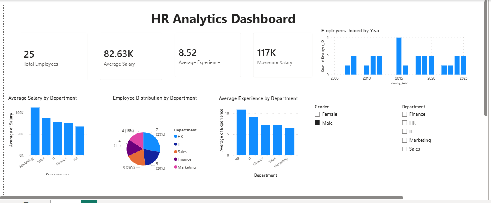

# HR Analytics Dashboard

## Project Overview
This project is an interactive HR Analytics Dashboard developed using Power BI. It provides insights into employee information such as salary, experience, department distribution, and joining trends through interactive visualizations.

## Tools Used
- Power BI
- DAX
- Microsoft Excel

## Key Features
- Total Employees KPI
- Average Salary KPI
- Average Experience KPI
- Maximum Salary KPI
- Average Salary by Department
- Average Experience by Department
- Employee Distribution by Department
- Employees Joined by Year
- Gender and Department Slicers

## Dashboard Preview



## DAX Measures

```DAX
Total Employees = COUNT(Employee[Employee_ID])

Average Salary = AVERAGE(Employee[Salary])

Average Experience = AVERAGE(Employee[Experience])

Maximum Salary = MAX(Employee[Salary])
```

## Skills Demonstrated

- Power BI
- DAX
- Data Visualization
- Dashboard Design
- Business Intelligence
- Interactive Reporting
